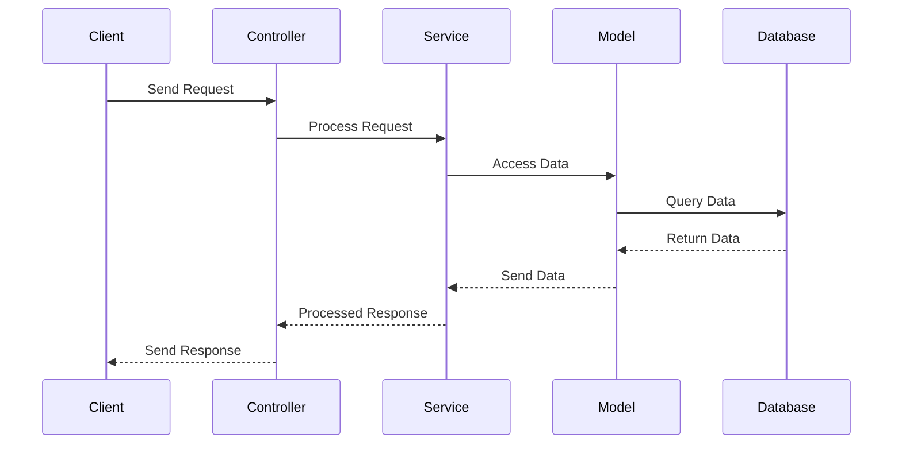
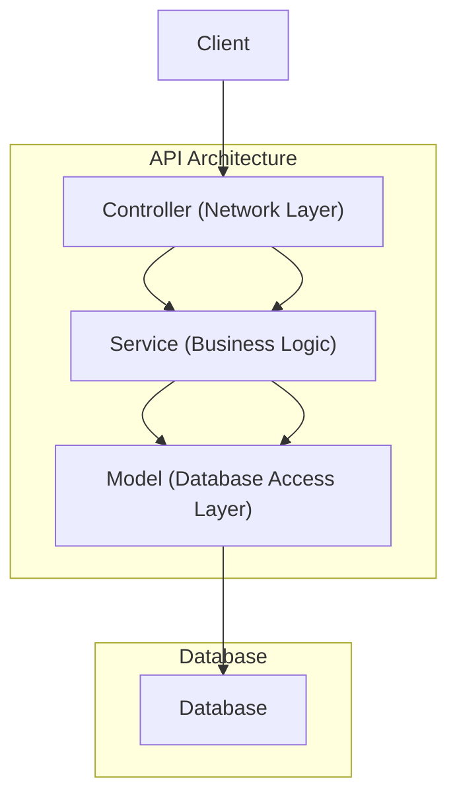

# Backend Architect


## Model Service Controller Pattern
### UML diagrams
- **Client** sends a request to the **Controller**. 
- The **Controller** forwards the request to the **Service** for business logic processing.
 - **Service** requests data from the **Model**. 
 - **Model** interacts with the **Database** to retrieve the necessary data. 
- The **Database** returns the data to the **Model**. 
- **Model** passes the data back to the **Service**. 
- **Service** processes the data and returns the response to the **Controller**.
 - Finally, the **Controller** sends the response back to the **Client**.


And this will produce a flow chart:



## Project Structure

```bash
├── controller
│   ├── # Controller Layer Code (Handles HTTP Requests/Responses)
│   └──users.controller.ts
├── core
│   ├── # Core Base Classes (Base classes for controllers, models, services)
│   ├── controller.core.ts   
│   └── service.core.ts
│
├── model
│   ├── # Database Access Layer (Interacts with Database)
│   ├── users.model.ts
│   ├── project.model.ts
│   └── tasks.model.ts
│
├── service
│   ├── # Business Logic Layer (Implements business rules and operations)
│   ├── users.service.ts
│   ├── project.service.ts
│   └── tasks.service.ts
│
├── shared
│   ├── # Shared Interfaces, Functions, and Variables
│   ├── utils
│  		└── websocket.utils.ts
│   └── interfaces.shared.ts
│
├── test
│   ├── # Unit Tests
│   ├── userController.test.ts
│   ├── productService.test.ts
│   └── orderModel.test.ts
```
### Controller
**Controller**: This is the user interface layer responsible for handling requests and responses from clients. In this project, we utilize **Elysia** to create the API instance and manage the endpoints effectively.
PS: we can integrate security (eg. Authentication or Authorization system and cookie checking system)

**Service**: This layer encapsulates the business logic of the application, adhering to the principle of "keeping it simple—doing one thing and doing it well." It comprises various functions designed to efficiently handle inputs and outputs, ensuring that the application operates smoothly and effectively. Additionally, we can inject caching into this Service layer to enhance performance and reduce latency.

##### Example of Service layer
``` javascript
async  getAllTask():  Promise<Task[]> {
	const  cacheKey  =  "tasks:all";
	const  cacheTasks  = await this.getFromCache(cacheKey);
	if (cacheTasks) return cacheTasks as  Task[];
	const  tasks  = await this.taskModel.findAll();
	if (!tasks) throw  new  Error("Task not found");
	await  this.setToCache(cacheKey, tasks);
	return tasks;
}

async  getTaskById(taskId:  string):  Promise<Task> {
	const  cacheKey  =  `tasks:${taskId}`;
	const  cacheTask  = await this.getFromCache(cacheKey);
	if (cacheTask) return cacheTask as  Task;
	const  task  = await this.taskModel.findById(taskId);
	if (!task) throw  new  Error("Task not found");
	await  this.setToCache(cacheKey, task);
	return task;
}
```

**Model**: This layer serves as the database access layer, responsible solely for interacting with the database. Its primary function is to facilitate communication between the application and the database, ensuring efficient data retrieval and storage without any additional logic.

**Utilities**: This folder contains `websocket.utils.ts`, a module designed to facilitate real-time data broadcasting via WebSocket. To use this functionality, simply import the module and call `WebSocket.broadcast("tagname", data);`. It’s important to carefully consider the `tagname`, as it helps identify messages for multiple clients, ensuring that each client can properly distinguish which messages are intended for them. It’s recommended to utilize the WebSocket utilities within the **controller layer** for optimal organization and functionality.

##### Example
```javascript
const  assignTask  = await taskService
						.assigningTaskToUser
						(
							body.taskId,
							body.userId
						);
WebSocket.broadcast("assigned", assignTask);
return assignTask;
```
**Core**: This folder contains the `BaseModel` and `BaseController` classes, designed to adhere to the principles of object-oriented programming (OOP). These base classes provide a foundational structure for the application's models and controllers, promoting code reuse and maintainability while ensuring a consistent approach across the application.

**Test**: This folder is dedicated to unit testing the service classes, ensuring that the application functions as intended. By implementing thorough tests, we can validate the correctness and reliability of the application’s business logic, ultimately contributing to a more robust and maintainable codebase.


## Technologies

-   **Elysia**: Used to create the API network, providing a robust framework for building and managing endpoints.
-   **PostgreSQL**: Utilized as the database, offering reliable and efficient data storage and retrieval.
-   **Redis**: Implemented for caching, enhancing performance by reducing latency in data access.
-   **MinIO**: Employed for file storage, enabling scalable and high-performance object storage.
-   **WebSocket**: Used to establish a socket network, facilitating real-time communication between clients and the server.
-   **Bun**: Utilized for running TypeScript and executing unit tests, streamlining the development workflow.
-   **Docker**: Used for containerization and deployment, ensuring a consistent environment across development and production.